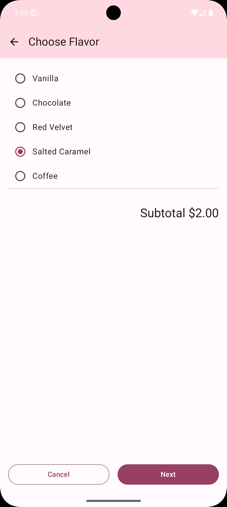

# Cupcake Ordering App

A simple Jetpack Compose Android application for ordering cupcakes.  
Users can choose quantity, flavor, pickup date, review their order, and share it with others.  
Includes **UI tests** to verify navigation flow, UI elements, and data persistence.

## Features
- Multi-screen navigation with **Navigation Compose**
- Quantity, flavor, and pickup date selection
- Order summary with share option
- **Jetpack Compose** UI
- **ViewModel** + **StateFlow** for state management
- **UI tests** with `compose.ui.test` APIs

## Screenshots

| Start Order | Select Flavor | Select Pickup Date |
|-------------|---------------|--------------------|
|  |  |  |

| Order Summary | Order Done                                | Share Sheet                           |
|---------------|-------------------------------------------|---------------------------------------|
|  |  |  |

## Tech Stack
- **Kotlin**
- **Jetpack Compose**
- **Navigation Compose**
- **Material 3**
- **ViewModel** & **StateFlow**
- **Jetpack Compose UI Testing**